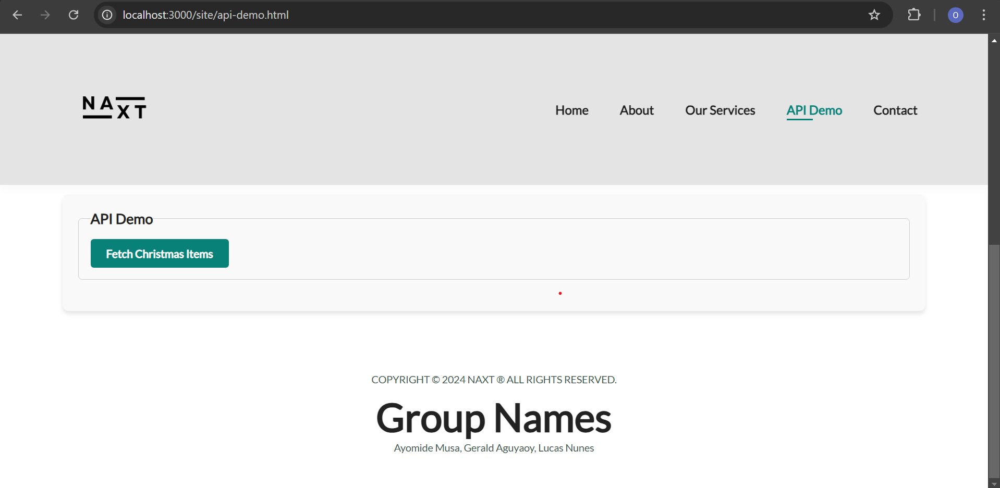
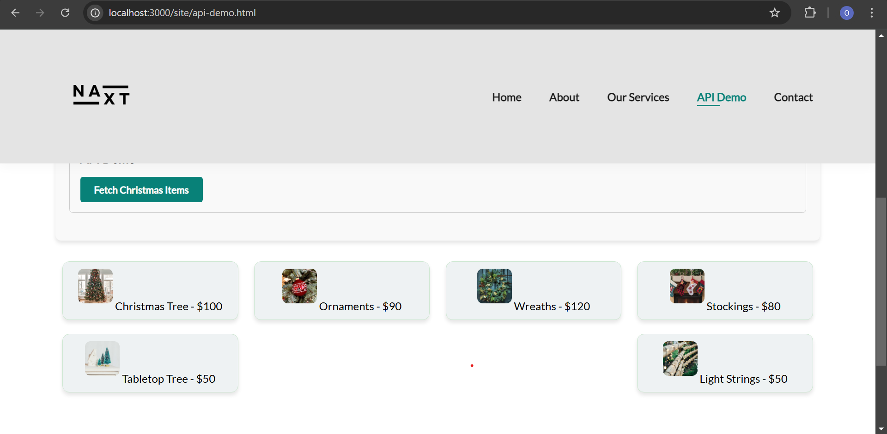

Microproject#1

A dynamic web project showcasing festive products with an API demo.

Features

Dynamic product display

Responsive design

API integration using Express.js

Fetch and display data with async/await

Installation

Clone the repository:

git clone <repository-url>

Navigate to the project directory:

cd "Microproject#1

Install dependencies:

npm install

Run the server:

npm start

## Screenshots

### API Demo - Step 1

### API Demo - Step 2

Contributors

Ayomide Musa

Gerald Aguyaoy

Lucas Nunes

License

MIT License

